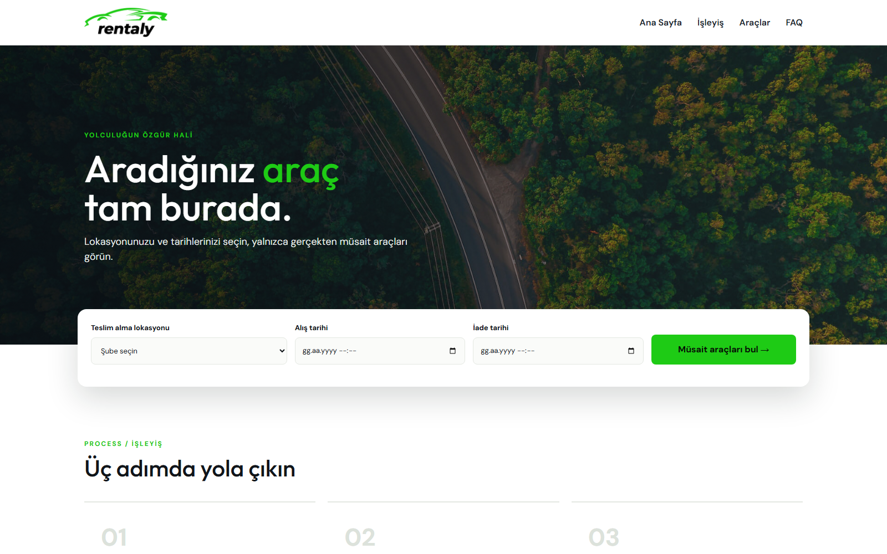
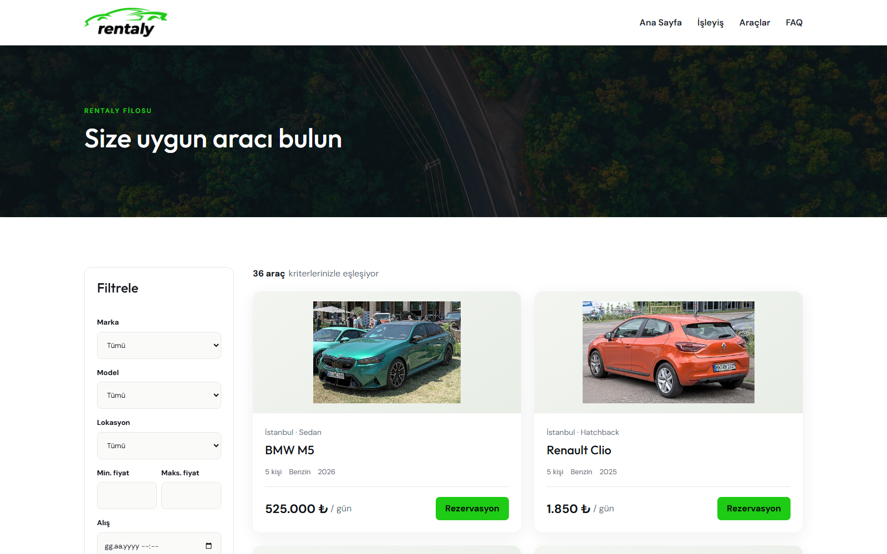
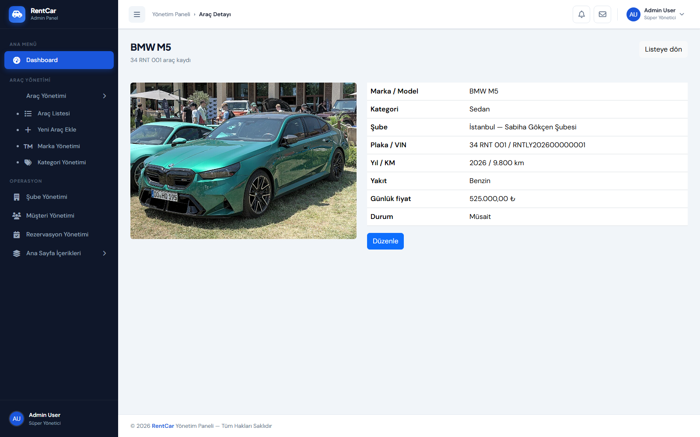
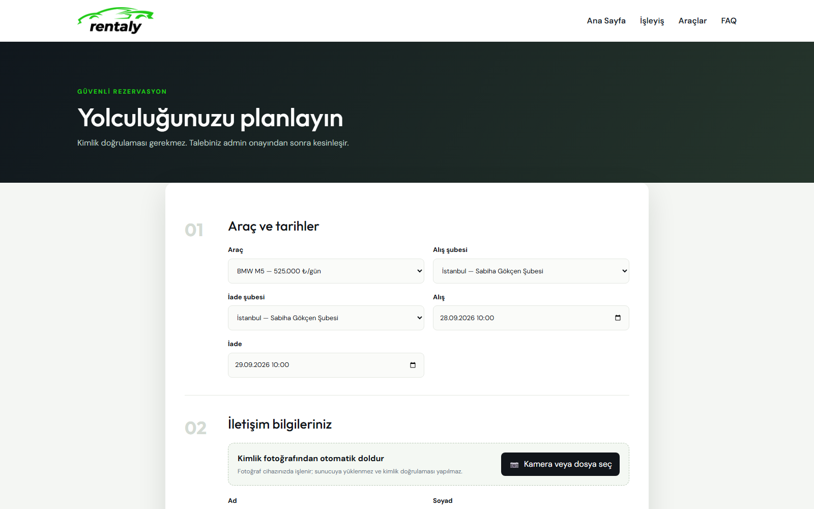
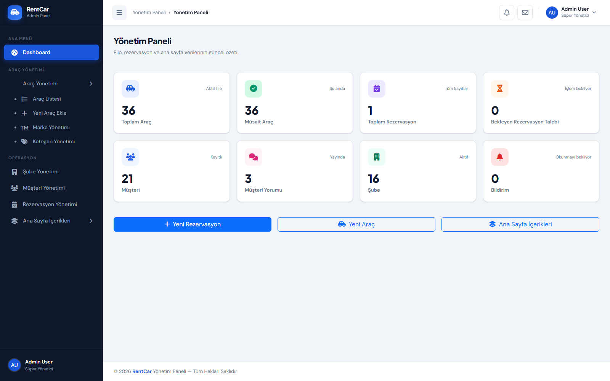
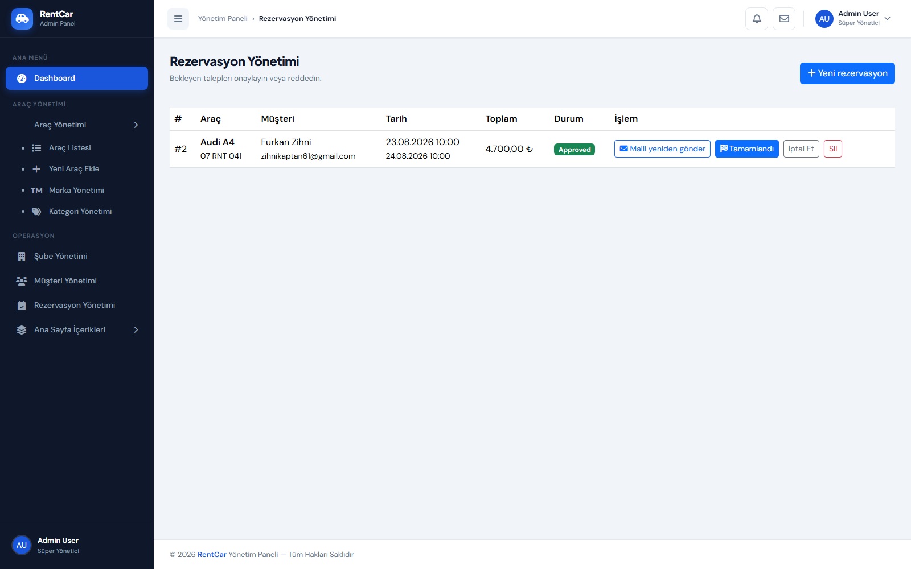
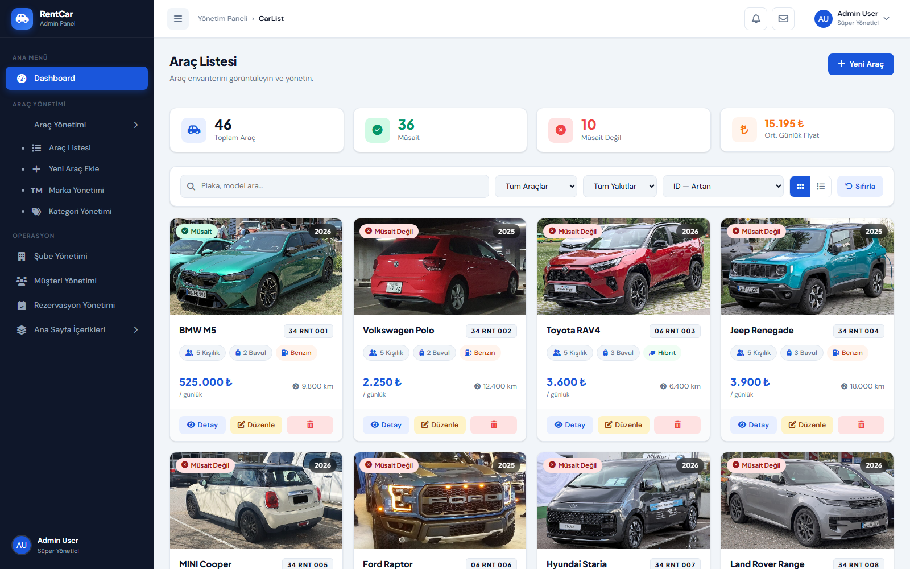
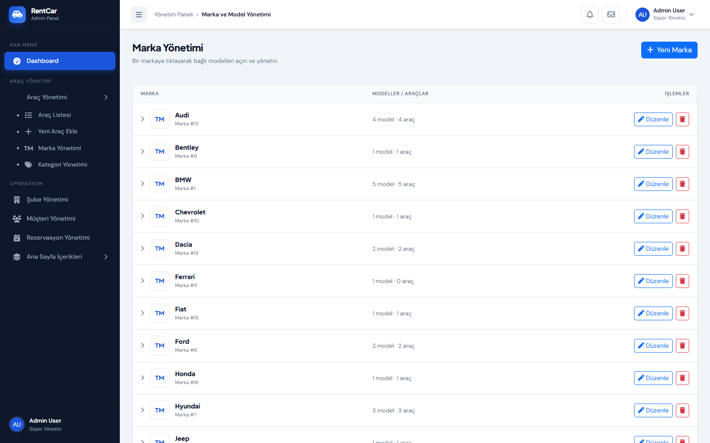
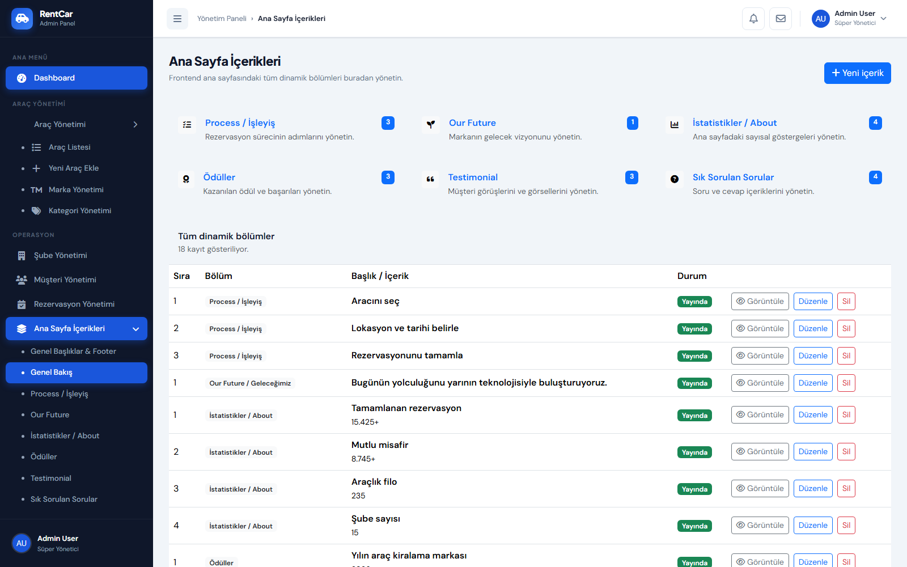
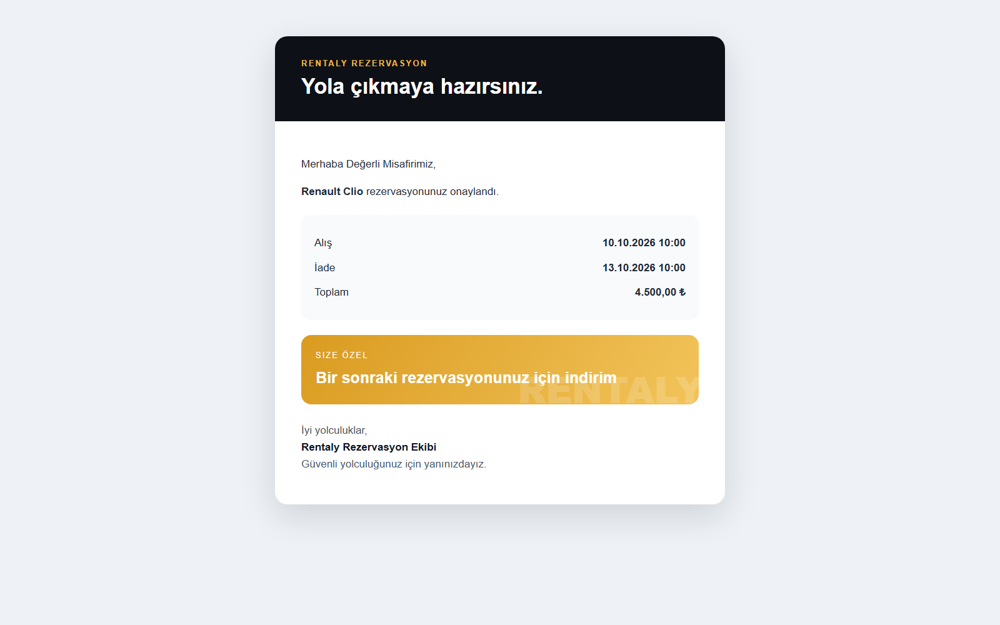

# Rentaly — Araç Kiralama ve Rezervasyon Yönetim Sistemi

Rentaly; araçların, şubelerin, markaların, modellerin, müşterilerin ve rezervasyonların tek bir sistem üzerinden yönetilebildiği ASP.NET Core MVC tabanlı bir araç kiralama uygulamasıdır.

Kullanıcı arayüzünde **Rentaly araç teması**, yönetim tarafında ise projeye özel geliştirilen **admin panel tasarımı** kullanılmaktadır. Uygulama N katmanlı mimariyle geliştirilmiştir.

## İçindekiler

- [Özellikler](#özellikler)
- [Ekran Görüntüleri](#ekran-görüntüleri)
- [Rezervasyon Akışı](#rezervasyon-akışı)
- [Proje Mimarisi](#proje-mimarisi)
- [Kullanılan Teknolojiler](#kullanılan-teknolojiler)
- [Kurulum ve Çalıştırma](#kurulum-ve-çalıştırma)
- [E-posta Yapılandırması](#e-posta-yapılandırması)
- [Testler](#testler)
- [Önemli Notlar](#önemli-notlar)

## Özellikler

### Kullanıcı arayüzü

- Veritabanından dinamik olarak beslenen ana sayfa
- Process / İşleyiş içerikleri
- Our Future / Geleceğimiz bölümü
- Canlı araç, müşteri ve rezervasyon istatistikleri
- Ana sayfada öne çıkan 10 araç
- Ödüller
- Müşteri yorumları / Testimonial
- Sık Sorulan Sorular / FAQ
- Modeller ve markalar
- Şube ve tarih aralığına göre müsait araç arama
- Marka, model, kategori, fiyat ve lokasyon filtreli araç filosu
- Araç detay ve rezervasyon sayfaları
- Özel tasarımlı 404 sayfası

### Rezervasyon sistemi

- Seçilen tarih aralığında araç müsaitlik kontrolü
- Çakışan rezervasyonların engellenmesi
- Rezervasyon oluşturulduğunda admin bildirimine düşmesi
- Bekleyen, onaylanan, reddedilen, iptal edilen ve tamamlanan rezervasyon durumları
- Admin onayından sonra kullanıcıya HTML onay e-postası gönderilmesi
- E-posta içerisinde rezervasyon bilgileri, kurumsal imza ve görsel indirim kuponu
- Onay e-postasını admin panelinden yeniden gönderme
- İptal veya ret durumunda tarih aralığının yeniden müsait hale gelmesi

### İsteğe bağlı kimlik OCR özelliği

Rezervasyon formunda kamera veya masaüstünden seçilen kimlik fotoğrafı, tarayıcı içerisinde Tesseract.js ile işlenebilir. Bulunan ad, soyad ve T.C. kimlik numarası alanları otomatik doldurulur.

Bu özellik kimlik doğrulaması yapmaz. Görsel sunucuya gönderilmeden kullanıcının cihazında işlenir.

### Admin paneli

- Araç ekleme, görüntüleme, güncelleme ve silme
- Kategori ekleme, güncelleme ve arşivleme
- Şube ekleme, güncelleme ve arşivleme
- Marka yönetimi
- Markaya tıklayarak ilgili modellere erişme
- Marka altında model ekleme, güncelleme ve silme
- Müşteri ekleme, görüntüleme, güncelleme ve arşivleme
- Rezervasyon ekleme, güncelleme, silme ve durum yönetimi
- Ana sayfa içeriklerini bölüm bazında yönetme
- Ana sayfa başlıkları, iletişim bilgileri ve görsellerini yönetme
- Dashboard üzerinde araç, rezervasyon, müşteri yorumu, bekleyen talep ve bildirim sayaçları
- Bekleyen rezervasyonlar için bildirim alanı

## Ekran Görüntüleri

Projenin kullanıcı arayüzü, rezervasyon akışı ve yönetim panelinden alınan güncel ekran görüntüleri aşağıdadır.

### Ana Sayfa



### Araç Filosu



### Araç Detayı



### Rezervasyon Formu



### Admin Dashboard



### Rezervasyon Yönetimi



### Araç Yönetimi



### Marka ve Model Yönetimi



### Ana Sayfa İçerik Yönetimi



### Onay E-postası



## Rezervasyon Akışı

```text
Kullanıcı lokasyon ve tarih seçer
              ↓
Sistem yalnızca müsait araçları listeler
              ↓
Kullanıcı aracı seçip rezervasyon talebi oluşturur
              ↓
Talep admin paneline ve bildirim alanına düşer
              ↓
Admin talebi onaylar
              ↓
Araç seçilen tarihler için kilitli kalır
              ↓
Kullanıcıya imzalı ve görsel kuponlu onay e-postası gönderilir
```

## Proje Mimarisi

Proje sorumlulukların birbirinden ayrıldığı N katmanlı mimari kullanır.

```text
Rentaly
├── Rentaly.EntityLayer
│   └── Veritabanı varlıkları ve enum tanımları
├── Rentaly.DtoLayer
│   └── Katmanlar ve sayfalar arasında taşınan DTO sınıfları
├── Rentaly.DataAccessLayer
│   ├── Entity Framework Core context
│   ├── Repository ve DAL sınıfları
│   └── Veritabanı migration dosyaları
├── Rentaly.BusinessLayer
│   ├── İş kuralları
│   ├── Servisler
│   ├── FluentValidation kuralları
│   └── AutoMapper profilleri
├── Rentaly.WebUI
│   ├── MVC controller ve view dosyaları
│   ├── Admin Area
│   ├── View component'ler
│   ├── E-posta servisi
│   └── CSS, JavaScript ve tema dosyaları
└── Rentaly.Tests
    └── xUnit iş kuralı ve doğrulama testleri
```

Katmanlar arasındaki temel bağımlılık akışı:

```text
WebUI → BusinessLayer → DataAccessLayer → Database
             ↓                ↓
          DtoLayer        EntityLayer
```

## Kullanılan Teknolojiler

- .NET 10
- ASP.NET Core MVC
- Entity Framework Core 10
- Microsoft SQL Server
- AutoMapper
- FluentValidation
- xUnit v3
- Bootstrap
- JavaScript
- Tesseract.js
- SMTP / HTML e-posta
- Rentaly kullanıcı arayüzü teması

## Kurulum ve Çalıştırma

### Gereksinimler

- [.NET 10 SDK](https://dotnet.microsoft.com/download)
- Microsoft SQL Server
- Visual Studio 2026 veya .NET CLI destekli bir geliştirme ortamı

### 1. Projeyi klonla

```bash
git clone <repository-url>
cd Rentaly
```

### 2. Veritabanı bağlantısını yapılandır

`Rentaly.WebUI/appsettings.json` dosyasındaki `DefaultConnection` değerini kendi SQL Server ortamına göre düzenle:

```json
{
  "ConnectionStrings": {
    "DefaultConnection": "Server=SUNUCU_ADI;Database=RentalyDb;Trusted_Connection=True;TrustServerCertificate=True;"
  }
}
```

### 3. Paketleri yükle ve projeyi derle

```bash
dotnet restore Rentaly.slnx
dotnet build Rentaly.slnx
```

Development ortamında uygulama başlatılırken bekleyen Entity Framework Core migration dosyaları otomatik uygulanır. İstersen migration işlemini manuel de çalıştırabilirsin:

```bash
dotnet ef database update --project Rentaly.DataAccessLayer --startup-project Rentaly.WebUI
```

### 4. Uygulamayı çalıştır

```bash
dotnet run --project Rentaly.WebUI
```

Varsayılan adresler:

- Kullanıcı arayüzü: `http://localhost:5158`
- Admin dashboard: `http://localhost:5158/admin`
- Rezervasyon yönetimi: `http://localhost:5158/Admin/Rentals`

## E-posta Yapılandırması

Admin bir rezervasyonu onayladığında e-posta gönderebilmek için SMTP ayarlarını yapılandır:

```json
{
  "Smtp": {
    "Host": "smtp.example.com",
    "Port": 587,
    "UserName": "smtp-kullanici-adi",
    "Password": "smtp-parolasi",
    "FromAddress": "rezervasyon@example.com",
    "FromName": "Rentaly Rezervasyon",
    "EnableSsl": true
  }
}
```

Gerçek SMTP parolalarını kaynak kontrolüne ekleme. Geliştirme ve sunucu ortamlarında environment variable veya güvenli secret yönetimi kullan.

Environment variable adları aşağıdaki biçimdedir:

```text
Smtp__Host
Smtp__Port
Smtp__UserName
Smtp__Password
Smtp__FromAddress
Smtp__FromName
Smtp__EnableSsl
```

SMTP yapılandırılmamışsa rezervasyon onaylanmaya devam eder ancak e-posta gönderilmez; admin panelinde bilgilendirme mesajı gösterilir.

## Testler

Tüm otomatik testleri çalıştırmak için:

```bash
dotnet test Rentaly.Tests/Rentaly.Tests.csproj
```

Çözümün tamamını doğrulamak için:

```bash
dotnet build Rentaly.slnx
dotnet test Rentaly.Tests/Rentaly.Tests.csproj --no-build
```

## Önemli Notlar

- Araç müsaitliği yalnızca aracın genel durumuna göre değil, seçilen tarih aralığındaki bekleyen ve onaylanan rezervasyonlara göre hesaplanır.
- Müşteri kayıtları rezervasyon geçmişini korumak amacıyla fiziksel olarak silinmek yerine arşivlenir.
- Şube arşivlendiğinde bağlı araçlar pasif ve müsait değil durumuna getirilir.
- Kategori arşivleme işlemi geçmiş araç ve rezervasyon ilişkilerinin korunmasını sağlar.
- Kimlik OCR özelliği isteğe bağlıdır ve kimlik doğrulama amacı taşımaz.
- `MSB3021` veya `MSB3027` dosya kilidi hatası alınırsa çalışan `Rentaly.WebUI` uygulamasını ya da Visual Studio debug oturumunu durdurup yeniden derleme yap.
